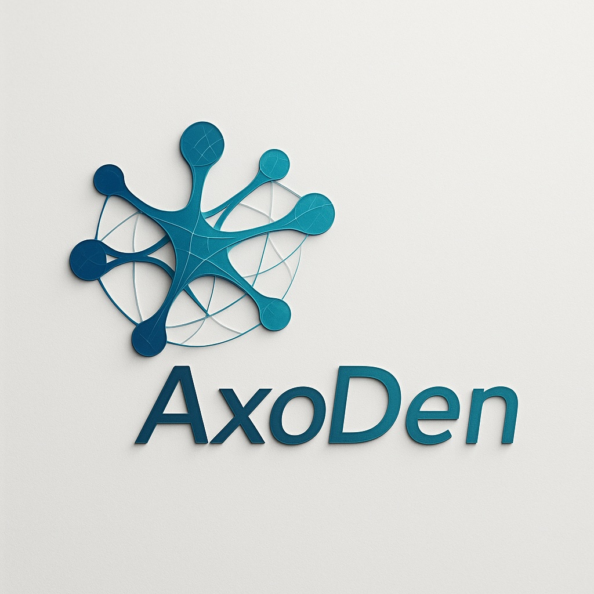

  

<h1 align="center">AxoDen Labs</h1>
<h3 align="center"><em>Reality computes — we’re learning its language.</em></h3>

---

  <a href="#about-axoden-labs">About</a> • 
  <a href="MANIFEST.md">Manifest</a> • 
  <a href="#axoden-helix4--from-law--proof--mind--action">Helix⁴</a> •
  <a href="#current-work">Current Work</a> • 
  <a href="#connect">Connect</a>

## About AxoDen Labs

AxoDen Labs explores how **physical law**, **mathematical structure**, and **cognitive introspection** produce **transparent, provable computational architectures**.

We operate as an open research collective bridging:
- **Theoretical physics** (entanglement, emergence, physical limits)
- **Artificial intelligence & cognition** (multi-agent reasoning, explainability)
- **Distributed systems & scientific software** (scalable, testable design)

Our research is guided by a unified model — **AxoDen Helix⁴** — connecting the foundations of reality, logic, mind, and implementation into one continuous feedback system.

> “Stephen Wolfram explored complexity emerging from simple rules.  
> AxoDen explores intelligence emerging from transparent reasoning frameworks.”

---
## AxoDen Helix⁴ — from Law → Proof → Mind → Action

**[Physics] → [Maths] → [Cognition] → [Engineering]**  
↺ *Feedback loop: measurement → new constraints → new designs*

- **Physics — Connectivity creates reality.**  
  Entanglement and geometry define the field of possible computation.

- **Maths — Structure creates truth.**  
  Proof-driven architectures and invariants formalize coherence.

- **Cognition — Interaction creates understanding.**  
  The Enhanced Cognitive Quad (C4) quantifies reasoning, stress, and uncertainty.

- **Engineering — Entropy creates adaptability.**  
  Entropy-aware, probabilistic systems realize the theory in code.

**Start here:**  
[Physics](./physics/whitepaper-0.md) ·
[Maths](./maths/proof-driven-architecture.md) ·
[Cognition (C4)](./cognition/c4-explainer.md) ·
[Engineering](./engineering/innovation-portfolio-2025.md)

---

## 🧩 Current Work

#### 🔬 Creative Remix Archive
Physics-inspired computational frameworks generated by the AxoDen methodology.  
Each brief links a physical phenomenon to a modern engineering pattern.  
→ _Index:_ [engineering/creative-remix-archive.md](./engineering/creative-remix-archive.md)

#### 📜 AxoDen Framework Whitepaper
Foundational papers describing the AxoDen dual-engine approach:  
**scientific validation + creative synthesis.**  
→ _Index:_ [whitepapers/](./whitepapers/README.md)

---

## 🌐 Connect

- **GitHub:** [@AxoDen-Labs](https://github.com/AxoDen-Labs)  
- **Email:** hello@axodenlabs.org *(coming soon)*

---
_© 2025 AxoDen Labs — Content licensed under [CC BY 4.0](https://creativecommons.org/licenses/by/4.0/)._

